# Architecture — subsystems of the Spec Kit Figma extension

This guide maps the extension's moving parts: which script owns which decision,
what each one reads and writes, and where a run can stop. It is written for
anyone modifying the extension, or debugging why a design section did (or did
not) appear in a generated document.

Every diagram reflects the shipped behaviour, not an intent. When the code and a
diagram disagree, the code wins — and the diagram is a bug.

> **Bash and PowerShell are two ports of one design.** Every helper exists twice,
> under `scripts/bash/*.sh` and `scripts/powershell/*.ps1`, with the same flags,
> the same JSON on stdout and the same exit codes. The diagrams below name the
> bash files; read `figma-ensure-context.ps1` wherever you see
> `figma-ensure-context.sh`.

## Contents

- [1. System context](#1-system-context)
- [2. Subsystem map](#2-subsystem-map)
- [3. Hook wiring — where the extension runs](#3-hook-wiring--where-the-extension-runs)
- [4. The ensure-context decision flow](#4-the-ensure-context-decision-flow)
- [5. Link resolution — three sources, two guards](#5-link-resolution--three-sources-two-guards)
- [6. Introspection pipeline](#6-introspection-pipeline)
- [7. Engine selection — REST and MCP](#7-engine-selection--rest-and-mcp)
- [8. Credential resolution](#8-credential-resolution)
- [9. Section lifecycle — render, paste, verify](#9-section-lifecycle--render-paste-verify)
- [10. Config topologies and target resolution](#10-config-topologies-and-target-resolution)
- [11. Workspace state and cache layout](#11-workspace-state-and-cache-layout)
- [12. Script contracts at a glance](#12-script-contracts-at-a-glance)

## 1. System context

The extension sits between SpecKit's generation commands and Figma. It never
talks to the developer directly: it is invoked by hooks, it answers with a JSON
status object, and the agent acts on that answer.

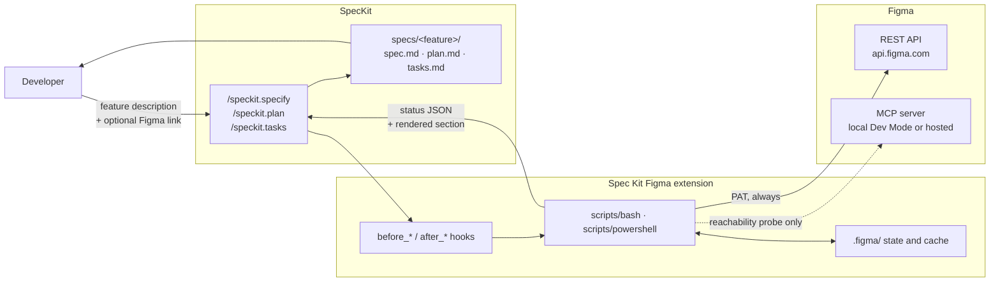

Two asymmetries in that picture are worth internalising, because most surprises
trace back to one of them:

- **The link, not the config, decides.** A mapped and enabled target is a
  precondition; a Figma link in the feature input is the trigger. See
  [section 4](#4-the-ensure-context-decision-flow).
- **MCP is probed, never fetched from.** The snapshot is always built over REST
  with a PAT, whatever `figma.contextSource` says. See
  [section 7](#7-engine-selection--rest-and-mcp).

## 2. Subsystem map

Nine helpers, three layers. Everything sources `figma-common`, and only
`figma-introspect` performs network reads.

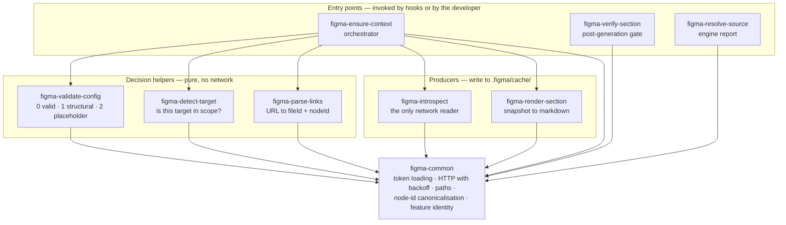

`figma-ensure-context` is the only component that composes the others. Each
helper it calls is independently runnable and independently testable — which is
why the test suite can exercise every skip reason without a Figma token.

## 3. Hook wiring — where the extension runs

`extension.yml` binds three commands to eleven hooks. All eleven are
`optional: false`, so the agent cannot decline them.

| Phase | Before | After | What the phase produces |
|-------|--------|-------|-------------------------|
| `specify` | `figma.ensure` | `figma.verify` | `spec.md` |
| `plan` | `figma.ensure` | `figma.verify` | `plan.md` |
| `tasks` | `figma.ensure` | `figma.verify` | `tasks.md` |
| `converge` | `figma.ensure` | `figma.verify` | appends to `tasks.md` |
| `analyze` | `figma.ensure` | `figma.drift` | *(no document)* |
| `implement` | `figma.ensure` | — | *(code)* |

The split matters. The first three phases produce a **document**, so `ensure`
renders a section and `verify` confirms it was pasted. `analyze` and `implement`
produce none: there `ensure` exists to load the **context** — the effective
ruleset (`.figma/figma-design-rules.md` plus the project overlay) and a current
snapshot.

`converge` sits with the first group: it assesses the codebase against the three
documents and **appends the remaining unbuilt work to `tasks.md`**, which makes
it a task-generating phase like `/speckit.tasks`. Converging without design
context means the unbuilt UI work is re-derived from prose alone, and
`implement` then builds from those valueless tasks. Because it *rewrites* a
document that already carries a section, `after_converge` runs the same
`--phase tasks` check as `after_tasks`: a rewrite is where a marker gets dropped.

`converge` is also the only reason `requires.speckit_version` is `>=0.11.2` —
its command template, and therefore its hook points, first ship in that release.
Every other hook here has existed since at least v0.9.5.

`implement` is the phase that actually writes the code, so it is the phase where
the rules bind — placement, token mapping, unit conversion, tests. Without its
hook they were loaded during spec/plan/tasks, when nothing is written, and absent
when the code was produced. It is also what restores the snapshot on a fresh
clone (`.figma/cache/` is git-ignored), which is what keeps the agent from
improvising a raw Figma MCP call with a node id re-extracted from a URL.

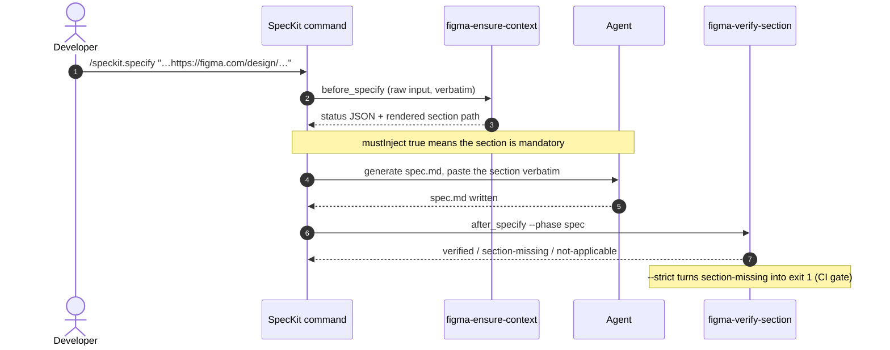

The same pair runs for `plan` and `tasks`. Only the first phase carries the link
in its input; the later two inherit it, which is what
[section 5](#5-link-resolution--three-sources-two-guards) is about.

`after_analyze` runs a different check. Analyze cross-checks `spec.md`,
`plan.md` and `tasks.md` against each other; the three can agree perfectly and
all be faithful to a creative the designer has since changed.
`figma-check-drift` compares the Figma `lastModified` recorded in the section
marker — `<!-- speckit-figma:section phase=spec file=<key> lastModified=<ts> -->`
— against the snapshot `before_analyze` just refreshed. The facts live in the
marker rather than in the prose so the check does not break the first time a
heading is reworded or translated.

## 4. The ensure-context decision flow

The heart of the extension. Its contract is **never block**: every configuration
problem is reported as a skip reason with exit 0, so generation always proceeds.
Non-zero exits are reserved for bad CLI arguments and unexpected internal errors.

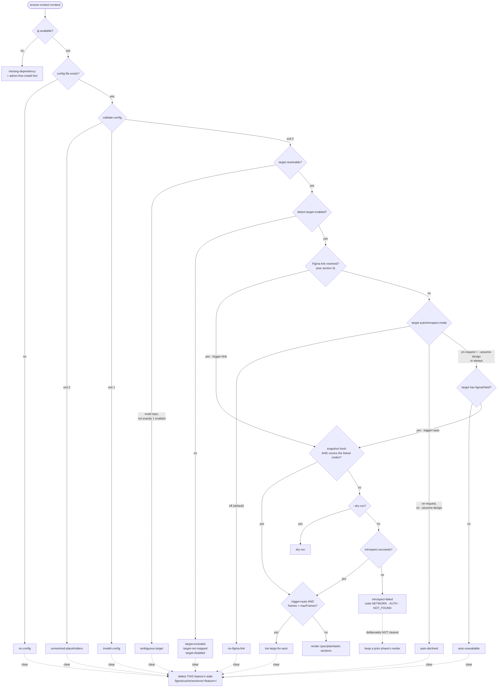

The `autoIntrospect` branch is an **opt-in** that a target declares in the
committed config; `off` is the default, so the graph above collapses to the
2.0.0 one for every workspace that says nothing. Three things make the opt-in
safe rather than a return to the pre-2.0.0 behaviour it replaced:

- **The config authorises, the agent triggers.** `--assume-design` is honoured
  only under `mode: "on-request"`; on `off` it is ignored with a warning. An
  agent cannot grant itself design context, and the grant is reviewable in a PR.
- **The frame budget is measured, not advisory.** It is evaluated *after* the
  snapshot exists — `/files/<key>?depth=2` is the call that produces the frame
  index — at all three points that reach one (fresh slot, restored per-file copy,
  fresh introspection), which is why they funnel through a single terminal
  helper. Link-driven runs are exempt: their node id already pins the creative.
- **Rule 5 is reused, not rebuilt.** An autonomous run contributes no `--node`,
  so `LINK_NODES` is empty, so the scope computation classifies it `broad` and
  the candidate frames are enumerated for confirmation. The safety net is
  structural rather than a second code path that could drift.

### Deterministic values — the model-proof half that was missing

`figma-render-section` filled the section's *structure* from the snapshot and
left its *values* to the model: the token, spacing and typography tables were
placeholders over a raw node dump that runs to megabytes for a full-page frame.
A model that will not read megabytes of JSON guesses instead, which is how a
faithful-looking spec yields an implementation matching nothing in the mockup.

`figma-extract-values` closes it. It walks the deep-fetched nodes and emits the
facts — layout mode, four paddings, item spacing, both axis alignments, corner
radius, box size; per text node the family, weight, size, line height, letter
spacing and alignment; and the `styles` ids that bridge to the Design System —
as a digest, rendered into the section as two tables the agent copies.

Three deliberate choices:

- **Units are always explicit.** `70px`, never `70`. A bare number is what lets a
  length be re-read as something else: passed to a scale-indexed helper —
  Tailwind's `mt-70`, MUI's `theme.spacing(70)` on a theme built with
  `spacing: 4` — a 70px margin renders 280px, wrong by the scale factor, and
  nothing fails. The extension states the absolute px value and stops there;
  the conversion contract belongs to the project (base rule 6b defers it to the
  `.figma/figma-design-rules.custom.md` overlay, exactly as rule 4 defers the
  responsive policy).
- **Absent is not zero.** Figma omits paddings that are zero on some node types.
  A fabricated `0px` reads as a deliberate design decision the mockup never made,
  so a value Figma did not send is simply not emitted.
- **Nodes with no design value contribute no row.** Structural containers would
  otherwise bury the handful of rows that matter under hundreds of empty ones,
  and `--max-rows` truncates with an explicit note rather than letting the table
  grow back into something nobody reads.

Two details in that graph carry real weight:

**Freshness is not just age.** A snapshot counts as fresh only when it exists, is
newer than the config, is younger than the max-age window (60 minutes by default,
`FIGMA_SNAPSHOT_MAX_AGE_MINUTES` or `--max-age-minutes`), **and** already covers
the linked file and every linked node. A pasted link pointing at a node the
snapshot lacks forces re-introspection, so a link can never be silently answered
with stale data.

**Stale renders are wiped, transient failures are not.** `figma-verify-section`
keys "Figma applied to this run" on the existence of
`.figma/cache/sections/<feature>/<phase>.md`. Leaving a previous run's file behind
would make the verifier demand a section the current document should never carry
— so every definitive skip deletes them. An `introspect-failed` is *not*
definitive: wiping there would erase a prior phase's still-valid render and let a
`--strict` CI gate pass for a run where Figma genuinely applies. It fails closed
instead.

The wipe is scoped to the **current feature**, and that scoping is load-bearing
for the same reason. While every feature shared one slot, running a design-less
feature erased a design feature's renders, so that feature's after-hook reported
`not-applicable` and a `--strict` gate passed for a document genuinely missing
its section — fail-open, precisely what the gate exists to prevent.

## 5. Link resolution — three sources, two guards

The developer pastes the link once, at `/speckit.specify`. `/speckit.plan` and
`/speckit.tasks` receive a different input that no longer carries it, so the link
has to be recovered.

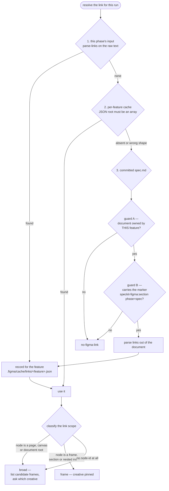

**Why source 3 exists.** `.figma/cache/` is git-ignored, so the per-feature memory
does not travel with the branch. A fresh clone, a CI job or a teammate who just
pulled reached `/speckit.plan` with no link and fell through to `no-figma-link` —
under which the agent adds *nothing* about Figma. `plan.md` silently lost the
design section `spec.md` carries. The committed document is the durable record.

**Why both guards exist.** A link source is exactly the place where a mistake is
silent, so recovery is deliberately narrow:

- *Guard A (`identified-only`)* — the document must be one the current feature
  positively owns, resolved from `SPECIFY_FEATURE`, then `.specify/feature.json`,
  then the git branch. The last-resort "the only spec around" rule that
  `figma-verify-section` may use is **disabled** here: with nothing identifying
  the feature, that spec belongs to another one, and inheriting its creative
  would re-create the very false positive the link trigger removes.
- *Guard B (marker)* — a `figma.com` URL merely mentioned in the prose of a spec
  is not a design section.

Prototype links contribute two node ids, not one: `node-id` (the frame the
designer was viewing) and `starting-point-node-id` (the entry point of the flow).
Both are deep-fetched in the same batched request.

## 6. Introspection pipeline

`figma-introspect` is the only component that reads from the network. It works in
three levels and stops at the deepest one it was given a handle for.

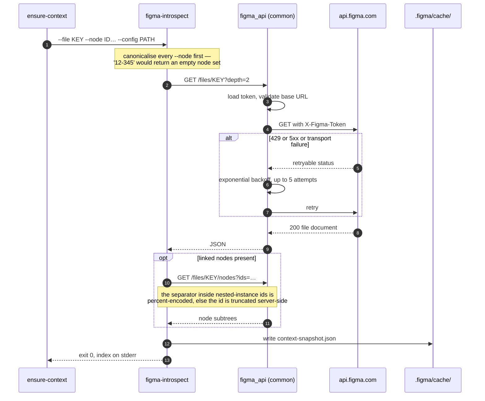

When a team or a project is given instead of a file (levels 1 and 2, used by
`/speckit.figma.introspect`), the pipeline first enumerates
`/teams/{id}/projects` then `/projects/{id}/files`, builds a nested
`teams[] → projects[] → files[]` index, and defaults to the first discovered
file. `figma-ensure-context` never takes that path: it is link-driven and always
passes `--file`.

Failures are classified rather than guessed. `figma_api` records a machine
readable cause — `NETWORK`, `AUTH`, `NOT_FOUND` — which the orchestrator reads
back and turns into a specific message, so a proxy problem is never reported as
a credentials problem.

## 7. Engine selection — REST and MCP

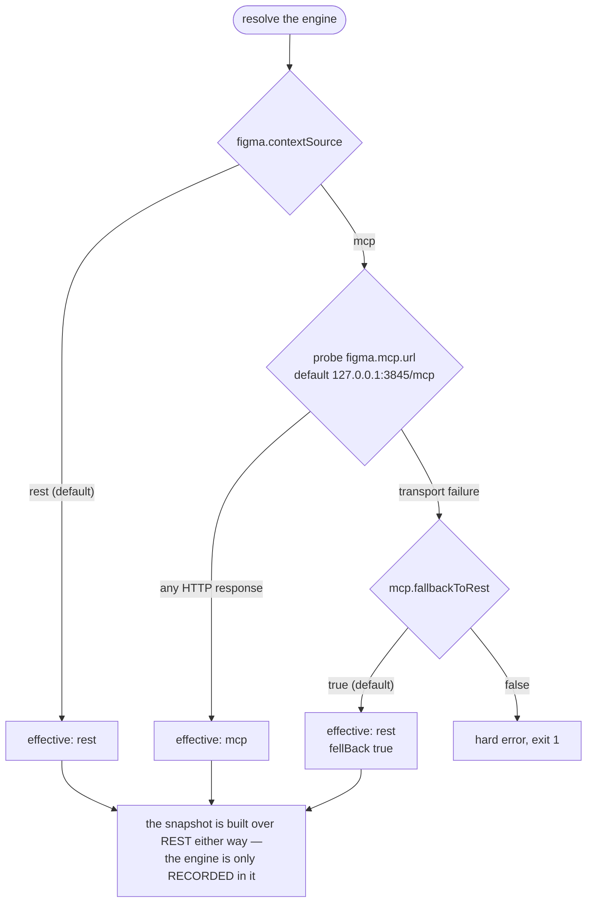

This is the single most misread part of the extension, so it is worth stating
flatly: **`contextSource: "mcp"` does not replace the PAT.** The deterministic
pipeline — introspect → snapshot → rendered section — always goes through the
REST API. What `"mcp"` adds is a field in the snapshot and a signal to the agent,
which may then query its own MCP tool to reproduce the mockup more faithfully.
MCP improves how the agent *renders* the design, not how the snapshot is
*collected*. A local Dev Mode server alone, with no PAT, fails introspection with
`"code": "AUTH"`.

## 8. Credential resolution

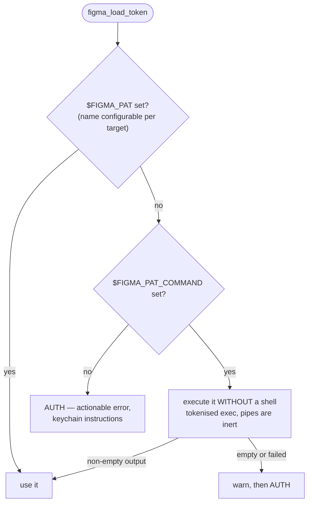

There is deliberately **no `.env` fallback**. Locally the token belongs in the OS
keychain, fetched through `FIGMA_PAT_COMMAND`; in CI it is injected as a secret.
`FIGMA_PAT_COMMAND` is read only from the local environment, never from the
committed config — a config value would let a pull request smuggle in a command.

## 9. Section lifecycle — render, paste, verify

The before-hook can guarantee the section *file* exists. It cannot guarantee the
agent pasted it. That is what the after-hook is for.

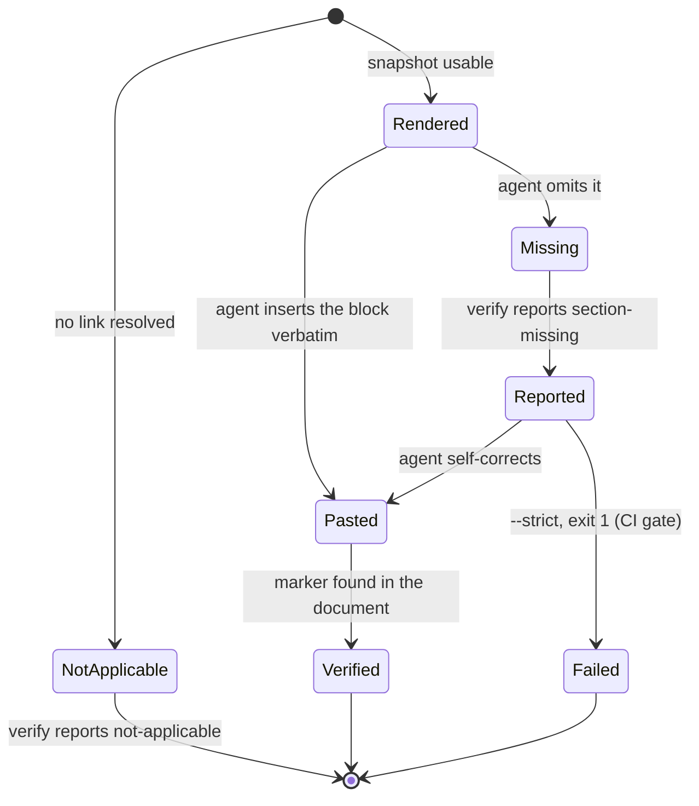

Verification keys on a phase-specific machine marker,
`<!-- speckit-figma:section phase=spec -->`, rather than on the heading text: the
heading is translatable, and a phase-agnostic match would accept a section pasted
for the wrong phase. A legacy heading is still recognised for backward
compatibility, but only for the matching phase.

The same marker is what makes the `spec.md` fallback of
[section 5](#5-link-resolution--three-sources-two-guards) safe — which is why it
must never be stripped from a generated document.

## 10. Config topologies and target resolution

`figma.projects.config.json` describes one of three shapes. `figma-detect-target`
turns a target name into an answer about whether Figma applies to it.

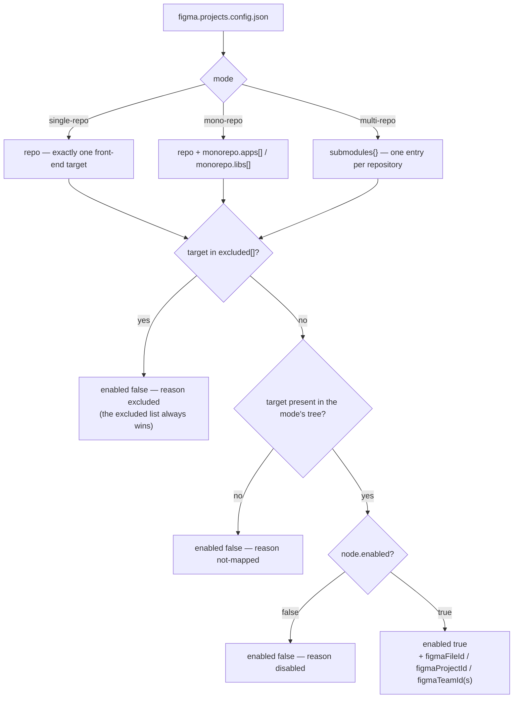

Every target must declare at least one Figma id
(`figmaFileId`, `figmaProjectId`, `figmaTeamId`, `figmaTeamIds`), and any
unresolved `REPLACE_WITH_*` placeholder is a hard validation failure — exit 2,
distinct from a structural error, so the orchestrator can name the real problem.
`config/figma.projects.config.schema.json` is the source of truth;
`figma-validate-config` is the portable jq subset checked at runtime.

**Not everything in the config is executable, and the distinction matters when
reading it.** Two fields look like machine inputs and are not:

- `role` — optional, validated against an enum when present, and read by no
  helper. `figma-detect-target` copies it into its JSON output and nothing
  consumes it. It documents what a target *is*, for a human.
- `pageToPackageMapping` — no script parses it. It is guidance in the
  `/speckit.figma.introspect` prompt, telling the agent which Figma pages belong
  to which package so extraction stays scoped in a mono-repo. Changing it changes
  what the agent is told, not what any code does.

Since the link became the trigger, the Figma ids themselves also stopped driving
`figma-ensure-context`: it never derives a scope from them. They serve manual
`/speckit.figma.introspect` runs and one informational message. What the
orchestrator still genuinely consumes from the config is narrow — whether the
target is enabled or excluded, the engine settings, the PAT variable name, and
`verifyStrict`.

## 11. Workspace state and cache layout

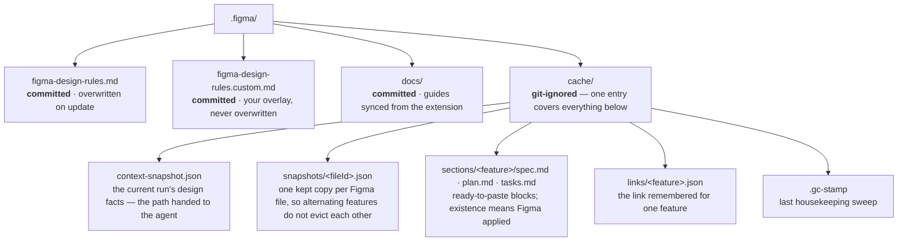

The extension's own code is not in there at all: `specify extension add` installs
it at `.specify/extensions/figma/` (`scripts/`, `templates/`, `commands/`,
`install.sh`), and that is where the helpers and templates **run from**. Nothing
is copied into `.specify/scripts/` or `.specify/templates/` — a second copy can
drift from the version SpecKit records in the tree's own `extension.yml`, and the
stale one is the one a developer ends up reading. The installer checks the tree
is present and stops if it is not, since wiring a project around helpers that are
absent yields a workspace that looks installed and fails on every hook.

The `committed` / `git-ignored` split is load-bearing. Anything under `cache/` is
reproducible and therefore disposable — but because it is disposable, nothing
that must survive a clone may live only there. That is exactly the constraint
that produced the `spec.md` fallback in
[section 5](#5-link-resolution--three-sources-two-guards).

### Housekeeping

Three of those four entries are keyed, so the cache only ever grew: a
`links/<key>.json` and a `sections/<key>/` per branch that ever ran a phase, a
`snapshots/<fileId>.json` per Figma file ever linked. Disk is not the problem —
key **reuse** is. A key derives from a branch name, so a new feature on a
recycled name would inherit the remembered links of whatever used the name
before it, and come back carrying a design section for a mockup that is not its
own.

`figma_gc_cache` / `Invoke-FigmaCacheGc` sweeps it, wired into
`figma-ensure-context` ahead of every early exit so the design-less runs — the
ones that produce the most orphans — clean up too. Its policy is **ownership
first, age second**; an entry goes only when both agree.

| Entry | Kept while | Collected when |
| --- | --- | --- |
| `links/<key>.json` | `specs/<key>/` exists, or `<key>` is the current feature | orphaned **and** untouched for the retention window |
| `sections/<key>/` | same | same, measured on the newest render inside |
| `snapshots/<fileId>.json` | — (no owner to consult) | older than the retention window **and** than the freshness window |
| `context-snapshot.json` | always — it is the current slot, not a keyed entry | never |

`specs/<key>/` is the durable ownership signal precisely because it is committed
and outlives its branch. Two guards keep the sweep from eating live state: the
current feature is exempt unconditionally (at `/speckit.specify` time the links
are written *before* the `specs/` directory exists), and a live feature's renders
are never collected — `figma-verify-section` reads "Figma applied to this run"
from their existence, so deleting them would turn a `--strict` CI gate
fail-open, the same failure the per-feature scoping above fixed.

The sweep is throttled to once a day through `.gc-stamp`, since the hook fires on
every phase, and it is skipped entirely on `--dry-run` — a rehearsal must not
change what a later real run decides. `FIGMA_CACHE_RETENTION_DAYS` overrides the
7-day window, `FIGMA_CACHE_GC=off` disables the sweep, `=force` ignores the
throttle. Every failure inside it is swallowed: housekeeping is never allowed to
be the reason a hook blocks generation.

## 12. Script contracts at a glance

| Script | Reads | Writes | Exit codes |
| --- | --- | --- | --- |
| `figma-ensure-context` | config, snapshot, links cache, `spec.md`, raw input | links cache, rendered sections, snapshot (via introspect), the daily cache sweep | 0 always, except bad args / internal error |
| `figma-introspect` | Figma REST API | `context-snapshot.json` | 0 ok, non-zero on API failure |
| `figma-render-section` | snapshot, templates, links | `sections/<feature>/<phase>.md` | 0 ok, non-zero on bad input |
| `figma-verify-section` | rendered section, generated document | — | 0, or 1 under `--strict` on a real defect |
| `figma-validate-config` | config | — | 0 valid, 1 structural, 2 placeholder |
| `figma-detect-target` | config | — | 0 for every mapping outcome, non-zero on structural error |
| `figma-parse-links` | free-form text | — | 0 always |
| `figma-resolve-source` | config, MCP probe | — | 0, or 1 when MCP is required and absent |

All of them print a JSON object on stdout and keep human-readable diagnostics on
stderr. That separation is what lets the orchestrator compose them and the agent
parse them, in the same run.

## See also

- [INSTALL.md](INSTALL.md) — installation, prerequisites, troubleshooting
- [CREDENTIALS.md](CREDENTIALS.md) — PAT scopes, keychain setup, proxy vs auth
- [MONOREPO.md](MONOREPO.md) — mono-repo and multi-repo mapping in practice
